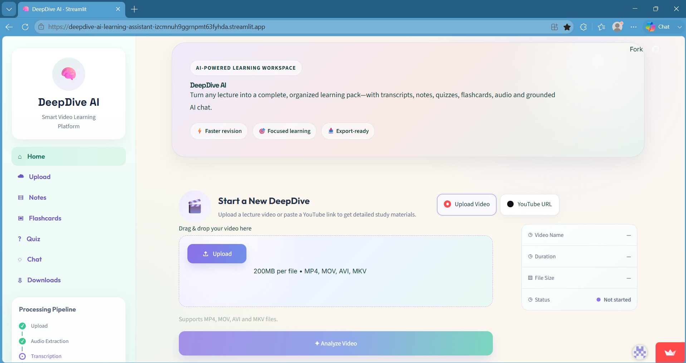
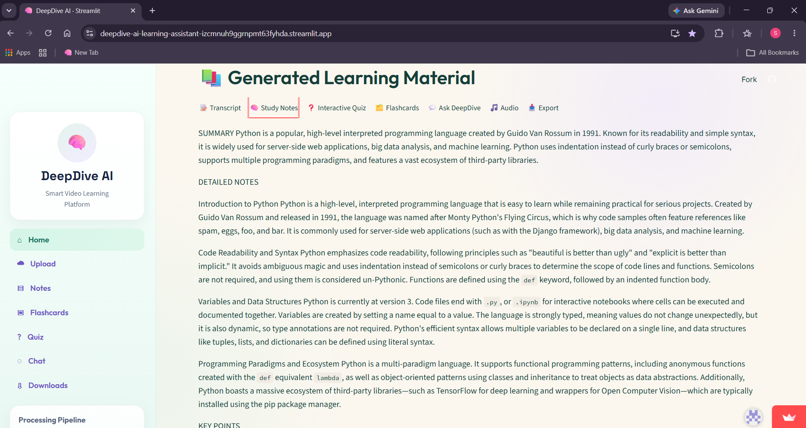
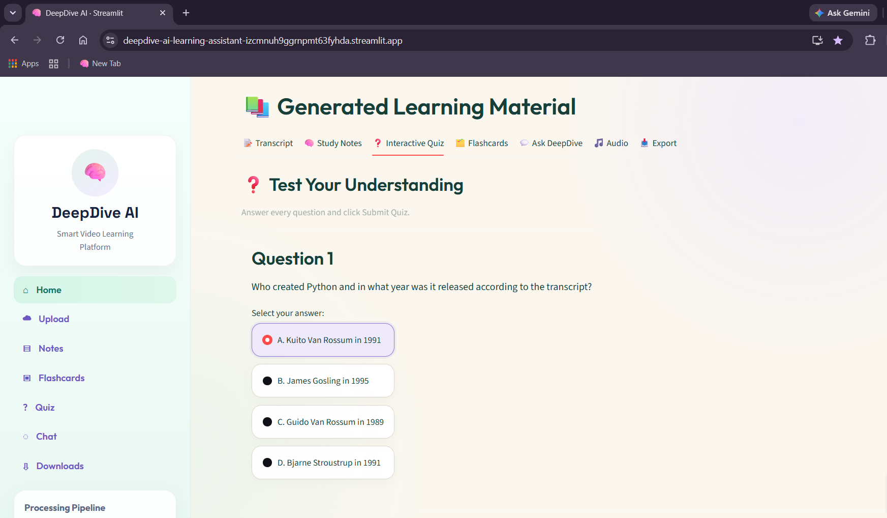
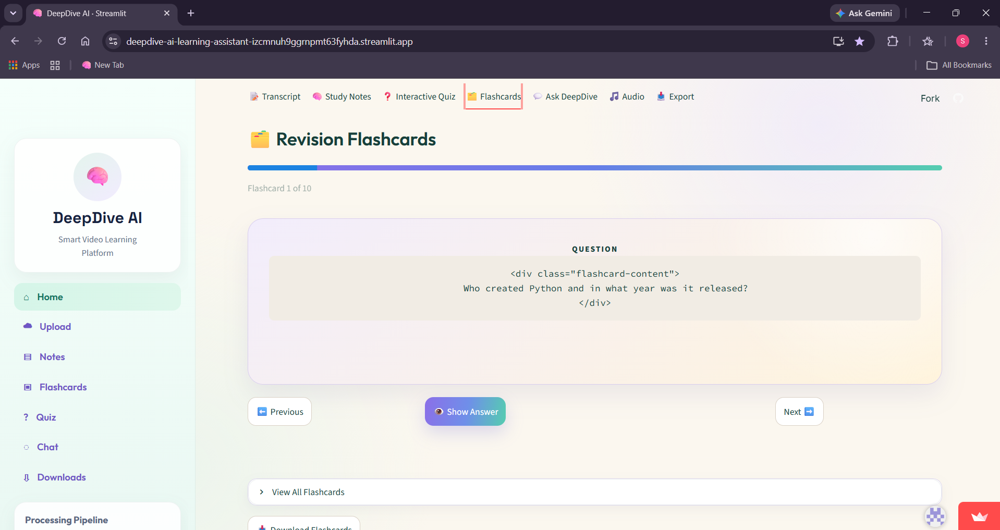
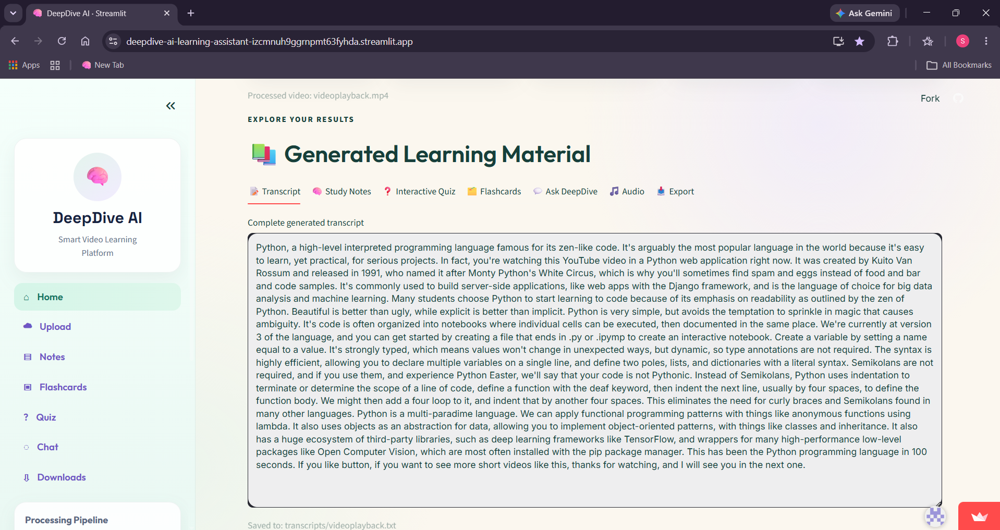
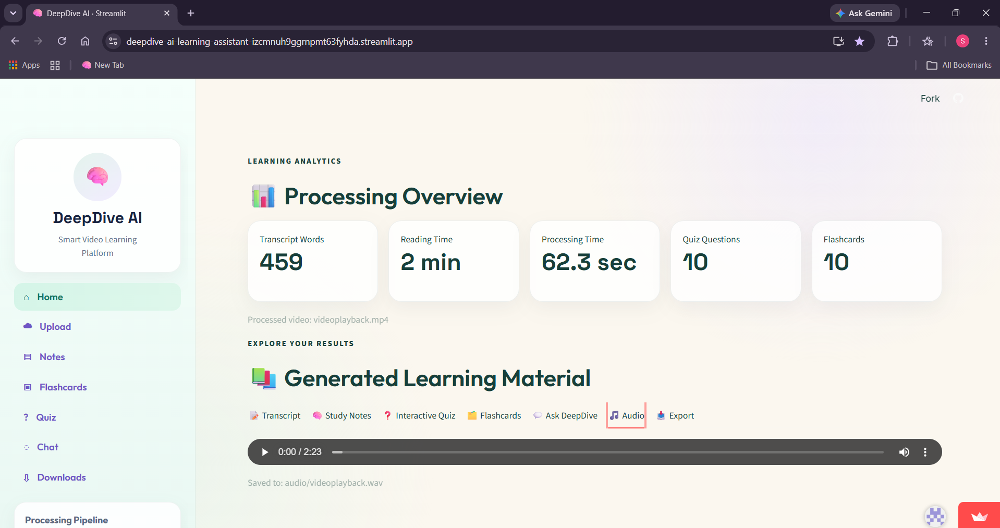
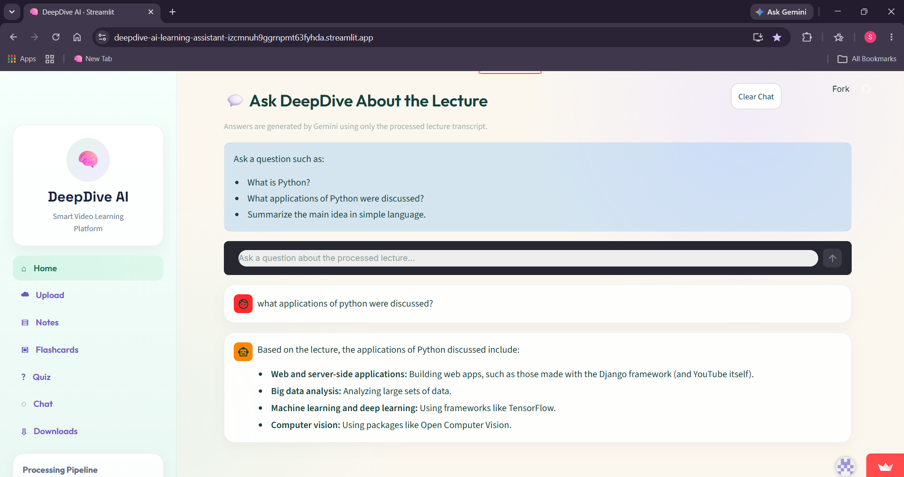

# DeepDive AI - Intelligent Video Note Taker

DeepDive AI is an AI-powered learning assistant that converts lecture videos into structured study material. It automatically generates transcripts, notes, quizzes, flashcards, PDFs, and provides an interactive chatbot for revision.

## Features

- Upload lecture videos
- Automatic audio extraction
- Speech-to-text transcription using Whisper
- AI-generated study notes
- Key point extraction
- Interactive quiz generation
- Flashcard generation
- Lecture chatbot
- PDF export
- Clean Streamlit interface

## Tech Stack

- Python
- Streamlit
- OpenAI Whisper
- MoviePy
- ReportLab
- Torch
- NumPy
- Pandas

## Project Workflow

1. Upload lecture video
2. Extract audio
3. Generate transcript
4. Create notes
5. Generate quiz
6. Generate flashcards
7. Chat with lecture
8. Export PDF

## Installation

```bash
git clone <repository-url>

cd deepdive-ai

pip install -r requirements.txt

streamlit run app.py
```

## Future Improvements

- YouTube URL support
- Multi-language transcription
- Cloud deployment
- Voice-based chatbot
- User authentication

## Author

Developed as an AI/ML academic project.
## Screenshots

### Home


### Notes


### Quiz


### Flashcards


### Transcript


### audio



### Chatbot
