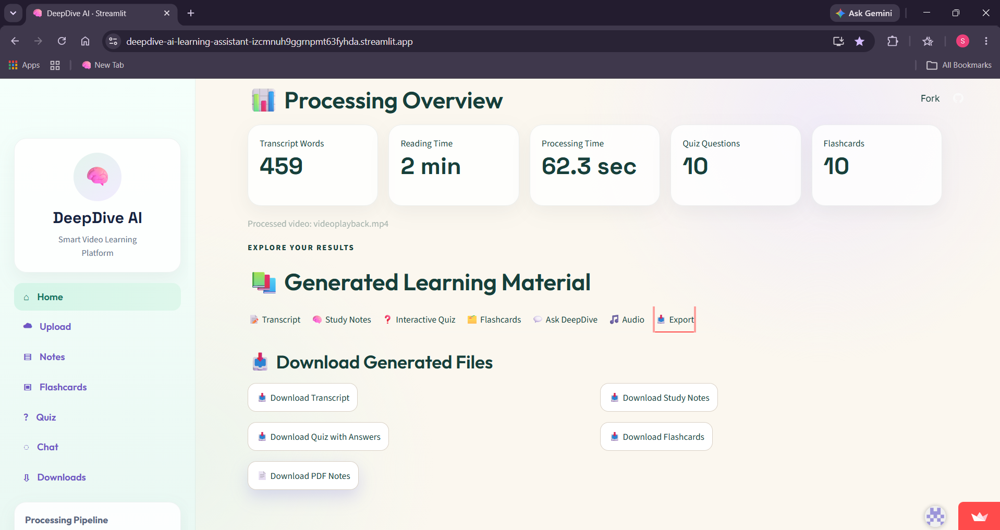

# 🎓 DeepDive AI – Intelligent Video Learning Assistant

DeepDive AI is an AI-powered learning assistant that converts lecture videos into structured study material using Google Gemini and OpenAI Whisper.

---

## 🚀 Live Demo

🔗 https://deepdive-ai-learning-assistant-izcmnuh9ggrnpmt63fyhda.streamlit.app/

---

## ✨ Features

- 🎥 Upload lecture videos
- 🎙️ Automatic speech-to-text transcription
- 📝 AI-generated study notes
- ❓ AI-generated quizzes
- 🗂️ AI flashcards
- 💬 Interactive lecture chatbot
- 📄 PDF study material export
- ☁️ Fully deployed on Streamlit Cloud

---

## 🛠 Tech Stack

- Python
- Streamlit
- Google Gemini API
- OpenAI Whisper
- MoviePy
- FFmpeg
- ReportLab

---

## 📊 Workflow

Video Upload

↓

Audio Extraction

↓

Whisper Transcription

↓

Gemini AI

↓

Study Notes

Quiz

Flashcards

Chatbot

↓

PDF Export

---

## 📸 Screenshots

### Home Page


### Audio Processing


### Generated Transcript


### AI-Generated Notes


### Quiz


### Flashcards


### Lecture Chat


### Download Study Materials



## 📦 Installation

```bash
git clone https://github.com/yourusername/deepdive-ai.git

cd deepdive-ai

pip install -r requirements.txt

streamlit run app.py
```

---

## 👨‍💻 Author

Samruddhi Bandbuche

BCA Student

Artificial Intelligence & Machine Learning Project
